# Scientific Evaluation Protocol for Veritas AI

**Document Version**: `v1.0`  
**Protocol Identifier**: `EVAL-PROTO-VERITAS-2026-09`  
**Target System**: Veritas AI (Evidence-Guided Self-Correcting Multi-Document RAG)  
**Corpus / Benchmark Reference**: [`backend/evaluation/benchmark_dataset.json`](file:///home/hp/veritas-ai/backend/evaluation/benchmark_dataset.json)  
**Configuration Reference**: [`config/evaluation_config.json`](file:///home/hp/veritas-ai/config/evaluation_config.json)

---

## 1. Executive Summary & Research Scope

Veritas AI is designed to address factual hallucination, multi-document evidence divergence, and unhandled cross-document contradictions in Retrieval-Augmented Generation (RAG). Its active architectural pipeline operates as follows:

$$\text{User Query} \xrightarrow{} \text{Hybrid BM25 + FAISS} \xrightarrow{} \text{RRF Fusion} \xrightarrow{} \text{Cross-Encoder Rerank} \xrightarrow{} \text{NLI Evidence Assessment} \xrightarrow{} \text{Diagnostic Self-Correction} \xrightarrow{} \begin{cases} \textbf{PASS} & (\text{Answer Synthesis}) \\ \textbf{CLARIFY} & (\text{Conflict Attribution}) \\ \textbf{STOP} & (\text{Non-Hallucinatory Refusal}) \end{cases}$$

This protocol establishes the rigorous, reproducible, and mathematically formal methodology for evaluating Veritas AI against competitive baselines and ablation variants across retrieval accuracy, generation faithfulness, citation grounding, diagnostic failure recovery, and runtime efficiency.

---

## 2. Frozen Benchmark Dataset Overview

The evaluation utilizes the frozen 100-query benchmark dataset ($N=100$) stratified across 6 distinct challenge categories:

| Category Code | Target Size | Source Provenance | Construction Type | Primary Research Challenge |
| :--- | :---: | :--- | :--- | :--- |
| `DIRECT_FACTOID` | 25 | HotpotQA Distractor Dev | Native | Single-document extractive retrieval & precision |
| `MULTI_DOCUMENT_MULTIHOP` | 25 | HotpotQA Bridge/Comparison | Native | Multi-document synthesis & query decomposition |
| `LEXICAL_SEMANTIC_DIVERGENCE` | 15 | BEIR NFCorpus | Native | Vocabulary mismatch & modality-bridging search |
| `INTER_DOCUMENT_CONTRADICTION` | 15 | RAGTruth Conflict Pairs | Native | Cross-document contradiction detection & uncertainty preservation |
| `AMBIGUOUS_ENTITY` | 10 | Multi-Candidate Entity Corpus | Controlled | Entity polysemy detection & clarification generation |
| `UNANSWERABLE_OUT_OF_DOMAIN` | 10 | Controlled Out-of-Corpus | Controlled | Non-hallucinatory refusal & terminal stopping |
| **TOTAL** | **100** | — | **80 Native / 20 Controlled** | — |

---

## 3. Metric Formulations and Calculation Methodology

### 3.1 Retrieval Quality Metrics

Let $Q$ be the set of queries, $\mathcal{D}_q^*$ be the set of gold relevant documents for query $q$, and $\mathcal{R}_{q,k} = [d_1, d_2, \dots, d_k]$ be the ranked list of top-$k$ retrieved documents ($k \in \{1, 3, 5, 10\}$, with $k=5$ as the primary operating cutoff).

#### 1. Recall@k
$$\text{Recall}@k(q) = \frac{|\mathcal{D}_q^* \cap \mathcal{R}_{q,k}|}{|\mathcal{D}_q^*|}, \quad \text{Recall}@k = \frac{1}{|Q_{\text{ans}}|} \sum_{q \in Q_{\text{ans}}} \text{Recall}@k(q)$$
*(Evaluated strictly over answerable queries $Q_{\text{ans}}$ where $|\mathcal{D}_q^*| > 0$).*

#### 2. Precision@k
$$\text{Precision}@k(q) = \frac{|\mathcal{D}_q^* \cap \mathcal{R}_{q,k}|}{k}, \quad \text{Precision}@k = \frac{1}{|Q|} \sum_{q \in Q} \text{Precision}@k(q)$$

#### 3. Mean Reciprocal Rank (MRR@k)
$$\text{MRR}@k = \frac{1}{|Q_{\text{ans}}|} \sum_{q \in Q_{\text{ans}}} \frac{1}{\min_{d_i \in \mathcal{D}_q^*} \text{rank}(d_i)}, \quad \text{where } \text{rank}(d_i) \le k \text{ else } \infty$$

#### 4. Normalized Discounted Cumulative Gain (nDCG@k)
$$\text{DCG}@k(q) = \sum_{i=1}^k \frac{2^{\text{rel}_i} - 1}{\log_2(i + 1)}, \quad \text{nDCG}@k(q) = \frac{\text{DCG}@k(q)}{\text{IDCG}@k(q)}, \quad \text{nDCG}@k = \frac{1}{|Q_{\text{ans}}|} \sum_{q \in Q_{\text{ans}}} \text{nDCG}@k(q)$$
Where $\text{rel}_i = 1$ if $d_i \in \mathcal{D}_q^*$ else $0$ (or graded qrel score for NFCorpus: $\{0, 1, 2\}$).

#### 5. Hit@k
$$\text{Hit}@k(q) = \mathbb{I}(|\mathcal{D}_q^* \cap \mathcal{R}_{q,k}| > 0), \quad \text{Hit}@k = \frac{1}{|Q_{\text{ans}}|} \sum_{q \in Q_{\text{ans}}} \text{Hit}@k(q)$$

#### 6. Multi-Document Gold Coverage Rate ($\text{Cov}_{\text{multi}}$)
For multi-hop queries requiring $M = |\mathcal{D}_q^*| \ge 2$ distinct documents:
$$\text{Cov}_{\text{multi}}(q) = \mathbb{I}(\mathcal{D}_q^* \subseteq \mathcal{R}_{q,k})$$

#### Special Rule for Unanswerable Queries
For $q \in Q_{\text{unans}}$ where $\mathcal{D}_q^* = \emptyset$: retrieval precision/recall are undefined; unanswerable queries are evaluated solely on correct retrieval rejection and refusal.

---

### 3.2 Answer Quality Metrics

Let $A_{\text{pred}}(q)$ be the generated answer string and $A_{\text{gold}}(q)$ be the reference answer string.

#### 1. Exact Match (EM)
$$\text{EM}(q) = \mathbb{I}(\text{normalize}(A_{\text{pred}}(q)) == \text{normalize}(A_{\text{gold}}(q)))$$
Normalization removes punctuation, articles (`a`, `an`, `the`), and lowercases text.

#### 2. Token-Level F1 Score
$$\text{Precision}_{\text{token}} = \frac{|\text{Tokens}(A_{\text{pred}}) \cap \text{Tokens}(A_{\text{gold}})|}{|\text{Tokens}(A_{\text{pred}})|}, \quad \text{Recall}_{\text{token}} = \frac{|\text{Tokens}(A_{\text{pred}}) \cap \text{Tokens}(A_{\text{gold}})|}{|\text{Tokens}(A_{\text{gold}})|}$$
$$\text{F1}_{\text{token}}(q) = \frac{2 \cdot \text{Precision}_{\text{token}} \cdot \text{Recall}_{\text{token}}}{\text{Precision}_{\text{token}} + \text{Recall}_{\text{token}} + \epsilon}$$

#### 3. Semantic Answer Correctness
For narrative/abstractive reference answers where string overlap is insufficient, we compute semantic embedding cosine similarity:
$$\text{Sim}_{\text{semantic}}(q) = \frac{\mathbf{e}(A_{\text{pred}}) \cdot \mathbf{e}(A_{\text{gold}})}{\|\mathbf{e}(A_{\text{pred}})\| \|\mathbf{e}(A_{\text{gold}})\|}$$

#### 4. LLM-as-a-Judge Protocol (Controlled Supplementary Evaluation)
When narrative quality requires categorical grading:
- **Judge Model**: `gpt-4o` or `gemini-1.5-pro` (Temperature = 0.0).
- **Scoring Rubric (1 to 5)**:
  - `5`: Completely accurate, all key facts present, zero hallucination.
  - `4`: Mostly accurate, minor omission, zero contradiction.
  - `3`: Partially accurate, contains unverified extraneous details.
  - `2`: Significant inaccuracies or missing core answer entity.
  - `1`: Direct contradiction with gold answer or completely irrelevant.
- **Scientific Safeguard**: LLM judge scores are strictly reported alongside deterministic EM/F1, and a 20% random sample ($N=20$) is subjected to blind human annotation to measure judge agreement ($\kappa > 0.80$).

---

### 3.3 Faithfulness & Hallucination Metrics

Let an answer $A_{\text{pred}}$ be decomposed into $N_{\text{claim}}$ atomic factual propositions $\{c_1, c_2, \dots, c_m\}$. Each claim $c_i$ is evaluated against retrieved evidence passages $\mathcal{E}$ via NLI DeBERTa:
$$\text{Status}(c_i, \mathcal{E}) \in \{\text{SUPPORTED}, \text{CONTRADICTED}, \text{UNSUPPORTED}\}$$

#### 1. Supported Claims Ratio ($\text{SCR}$)
$$\text{SCR} = \frac{\sum_{i=1}^{N_{\text{claim}}} \mathbb{I}(\text{Status}(c_i, \mathcal{E}) = \text{SUPPORTED})}{N_{\text{claim}}}$$

#### 2. Hallucination Rate ($\text{HR}$)
$$\text{HR} = \frac{\sum_{i=1}^{N_{\text{claim}}} \mathbb{I}(\text{Status}(c_i, \mathcal{E}) \in \{\text{UNSUPPORTED}, \text{CONTRADICTED}\})}{N_{\text{claim}}} = 1.0 - \text{SCR}$$

#### 3. Evidence-Grounded Answer Rate ($\text{EGAR}$)
$$\text{EGAR} = \frac{1}{|Q|} \sum_{q \in Q} \mathbb{I}(\text{SCR}(q) = 1.0 \land \text{Status}(A_{\text{pred}}) \ne \text{CONTRADICTED})$$

---

### 3.4 Citation Quality Metrics

Let $\mathcal{C}_{\text{pred}}(q)$ be the set of document/chunk citations emitted in the answer, and $\mathcal{D}_q^*$ be the gold supporting documents.

#### 1. Citation Precision ($\text{Prec}_{\text{cite}}$)
$$\text{Prec}_{\text{cite}}(q) = \frac{|\mathcal{C}_{\text{pred}}(q) \cap \mathcal{D}_q^*|}{|\mathcal{C}_{\text{pred}}(q)| + \epsilon}$$

#### 2. Citation Recall ($\text{Rec}_{\text{cite}}$)
$$\text{Rec}_{\text{cite}}(q) = \frac{|\mathcal{C}_{\text{pred}}(q) \cap \mathcal{D}_q^*|}{|\mathcal{D}_q^*|}$$

#### 3. Citation F1 ($\text{F1}_{\text{cite}}$)
$$\text{F1}_{\text{cite}}(q) = \frac{2 \cdot \text{Prec}_{\text{cite}}(q) \cdot \text{Rec}_{\text{cite}}(q)}{\text{Prec}_{\text{cite}}(q) + \text{Rec}_{\text{cite}}(q) + \epsilon}$$

#### 4. Citation Correctness Rate
$$\text{Acc}_{\text{cite}} = \frac{1}{|Q_{\text{ans}}|} \sum_{q \in Q_{\text{ans}}} \mathbb{I}(\mathcal{C}_{\text{pred}}(q) \subseteq \mathcal{D}_q^* \land |\mathcal{C}_{\text{pred}}(q)| > 0)$$

---

### 3.5 Self-Correction & Closed-Loop Effectiveness Metrics

Let $Q_{\text{fail}}$ be the set of queries that experience an initial retrieval failure mode ($S_{\text{suff}}^{(0)} < \theta_{\text{suff}}$ or contradiction detected), and $Q_{\text{succ}}$ be queries where initial retrieval was already sufficient.

#### 1. Failure Detection Precision, Recall, and F1
$$\text{Prec}_{\text{detect}} = \frac{|\text{Detected Failures} \cap \text{True Inadequate Retrieval}|}{|\text{Detected Failures}|}$$
$$\text{Rec}_{\text{detect}} = \frac{|\text{Detected Failures} \cap \text{True Inadequate Retrieval}|}{|\text{True Inadequate Retrieval}|}$$
$$\text{F1}_{\text{detect}} = \frac{2 \cdot \text{Prec}_{\text{detect}} \cdot \text{Rec}_{\text{detect}}}{\text{Prec}_{\text{detect}} + \text{Rec}_{\text{detect}}}$$

#### 2. Recovery Rate ($\text{RR}$)
The proportion of initially failed queries that successfully recover to a validated sufficient state after diagnostic self-correction:
$$\text{RR} = \frac{|\{q \in Q_{\text{fail}} \mid \text{Final Decision}(q) = \textbf{PASS} \land \text{EM}(q) = 1\}|}{|Q_{\text{fail}}|}$$

#### 3. Correction Success Rate ($\text{CSR}$)
$$\text{CSR} = \frac{|\{q \in Q_{\text{fail}} \mid S_{\text{suff}}^{(\text{final})}(q) \ge \theta_{\text{suff}} \land S_{\text{cons}}^{(\text{final})}(q) \ge 1 - \theta_{\text{contra}}\}|}{|Q_{\text{fail}}|}$$

#### 4. False Retry Rate ($\text{FRR}$)
The proportion of already sufficient queries erroneously triggered for unnecessary re-retrieval:
$$\text{FRR} = \frac{|\{q \in Q_{\text{succ}} \mid \text{Initial Action}(q) = \textbf{RETRY}\}|}{|Q_{\text{succ}}|}$$

#### 5. Average Correction Iterations ($\bar{N}_{\text{iter}}$)
$$\bar{N}_{\text{iter}} = \frac{1}{|Q|} \sum_{q \in Q} N_{\text{iterations}}(q), \quad \text{where } N_{\text{iterations}} \in [0, \text{max\_retries}]$$

#### 6. Sufficiency Score Delta ($\Delta S_{\text{suff}}$)
$$\Delta S_{\text{suff}} = \frac{1}{|Q_{\text{fail}}|} \sum_{q \in Q_{\text{fail}}} \left(S_{\text{suff}}^{(\text{final})}(q) - S_{\text{suff}}^{(0)}(q)\right)$$

#### 7. Correct Final Action Accuracy ($\text{Acc}_{\text{action}}$)
$$\text{Acc}_{\text{action}} = \frac{1}{|Q|} \sum_{q \in Q} \mathbb{I}(\text{Actual Final Action}(q) == \text{Expected Final Action}(q))$$

---

### 3.6 Contradiction Handling Metrics

Evaluated specifically over the 15 `INTER_DOCUMENT_CONTRADICTION` benchmark cases:

#### 1. Contradiction Detection F1 ($\text{F1}_{\text{contra}}$)
Precision and Recall in flagging the presence of conflicting propositions across distinct source documents.

#### 2. Conflict Preservation Rate ($\text{CPR}$)
$$\text{CPR} = \frac{|\{q \in Q_{\text{contra}} \mid \text{Clarification message explicitly quotes both conflicting sources}\}|}{|Q_{\text{contra}}|}$$

#### 3. Inappropriate Single-Truth Resolution Rate ($\text{IRR}$)
The failure rate where the system arbitrarily adopts one conflicting claim as absolute fact without alerting the user:
$$\text{IRR} = \frac{|\{q \in Q_{\text{contra}} \mid \text{Final Decision}(q) = \textbf{PASS} \land \text{Conflicting claim omitted}\}|}{|Q_{\text{contra}}|}$$

#### 4. Correct Clarification Action Rate
$$\text{Acc}_{\text{clarify}} = \frac{|\{q \in Q_{\text{contra}} \mid \text{Final Decision}(q) = \textbf{CLARIFY}\}|}{|Q_{\text{contra}}|}$$

---

### 3.7 Efficiency & Computational Cost Metrics

All efficiency metrics are logged per-query and reported with both **Mean** and **Median**:

| Metric | Measurement Unit | Description |
| :--- | :--- | :--- |
| **End-to-End Latency ($T_{\text{e2e}}$)** | Milliseconds ($\text{ms}$) | Total wall-clock time from query arrival to final response |
| **Retrieval Latency ($T_{\text{ret}}$)** | Milliseconds ($\text{ms}$) | Cumulative time spent in BM25 + FAISS index lookups |
| **Reranking Latency ($T_{\text{rerank}}$)** | Milliseconds ($\text{ms}$) | Cumulative time spent in Cross-Encoder inference |
| **Verification Latency ($T_{\text{verif}}$)** | Milliseconds ($\text{ms}$) | Cumulative time spent in NLI DeBERTa inference |
| **Self-Correction Overhead ($T_{\text{loop}}$)** | Milliseconds ($\text{ms}$) | Wall-clock time spent inside corrective loop retries |
| **Retrieval Calls Count ($N_{\text{ret}}$)** | Integer | Number of index queries executed per benchmark question |
| **LLM Inference Calls ($N_{\text{llm}}$)** | Integer | Number of prompt generation calls executed |
| **Input / Output Token Count** | Tokens | Exact token counts measured via tokenizer / API headers |
| **Estimated Query Cost** | USD ($\$$) | Projected financial cost based on public token pricing |

---

## 4. Experimental Baselines

To rigorously demonstrate the specific research contribution of Veritas AI, we define four standardized baseline systems:

```mermaid
graph TD
    subgraph "B1: Dense RAG"
        D1["Query"] --> D2["FAISS Search (Top-k)"] --> D3["Direct Answer Synthesis"]
    end
    
    subgraph "B2: Hybrid RAG"
        H1["Query"] --> H2["BM25 + FAISS"] --> H3["RRF Fusion"] --> H4["Cross-Encoder Reranking"] --> H5["Direct Answer Synthesis"]
    end
    
    subgraph "B3: CRAG Baseline"
        C1["Query"] --> C2["FAISS Search"] --> C3["Heuristic Retrieval Evaluator"] --> C4["Generic Rewrite Fallback"] --> C5["Answer Synthesis"]
    end
    
    subgraph "Proposed: Veritas AI"
        V1["Query"] --> V2["BM25 + FAISS"] --> V3["RRF"] --> V4["Cross-Encoder"] --> V5["NLI Multi-Facet Assessment"] --> V6["Diagnostic Failure Diagnosis"] --> V7["Diagnostic Query Reformulator"] --> V8["PASS / CLARIFY / STOP"]
    end
```



### Component Breakdown by Baseline:

| Component | B1: Dense RAG | B2: Hybrid RAG | B3: CRAG Baseline | Veritas AI (Proposed) |
| :--- | :---: | :---: | :---: | :---: |
| **Dense Vector Index (FAISS)** | Enabled | Enabled | Enabled | Enabled |
| **BM25 Lexical Index** | Disabled | Enabled | Disabled | Enabled |
| **Reciprocal Rank Fusion (RRF, $k=60$)** | Disabled | Enabled | Disabled | Enabled |
| **Cross-Encoder Reranker (`ms-marco-MiniLM`)** | Disabled | Enabled | Disabled | Enabled |
| **Retrieval Evaluation Layer** | Disabled | Disabled | Heuristic Confidence | Formal Multi-Facet ($S_{\text{rel}}, S_{\text{cov}}, S_{\text{cons}}$) |
| **Semantic NLI Contradiction (`nli-deberta-v3`)**| Disabled | Disabled | Disabled | Enabled |
| **Failure Taxonomy Diagnosis** | Disabled | Disabled | Binary (Correct/Ambiguous) | 5-Mode Taxonomy |
| **Query Reformulation Strategy** | Disabled | Disabled | Generic Keyword Expansion | Mode-Specific Diagnostic Expansion |
| **Closed-Loop Stopping Criteria** | None | None | Threshold Count | Strict Mathematical ($\Delta S_{\text{suff}} < 0.05$, $N \le 2$) |
| **Uncertainty Attribution Output** | None | None | None | Attribution-Preserving `CLARIFY` |

---

## 5. Ablation Study Matrix

Six systematic ablation experiments isolate and quantify the exact performance delta contributed by each component:

| Experiment Code | Disabled / Modified Component | Exact System Configuration | Research Hypothesis / Question Tested |
| :--- | :--- | :--- | :--- |
| **`ABL-01: No-Hybrid`** | BM25 Lexical Retrieval & RRF | Dense FAISS only + Cross-Encoder + Veritas Correction | *Quantifies the impact of sparse lexical retrieval on keyword-heavy and terminology-mismatched queries (`LEXICAL_SEMANTIC_DIVERGENCE`).* |
| **`ABL-02: No-Rerank`** | Cross-Encoder Reranking | Hybrid BM25 + FAISS directly into RRF top-$k$ | *Determines whether cross-encoder reranking is required before evidence assessment or if RRF rank scores suffice.* |
| **`ABL-03: No-NLI`** | DeBERTa NLI Verification | Replaced with token-overlap heuristic verification | *Validates whether deep semantic NLI is necessary for cross-document contradiction detection and consistency scoring.* |
| **`ABL-04: No-Diagnostic`**| Diagnostic Reformulator | Replaced with naive query repetition and generic keyword addition | *Proves that failure-mode-guided reformulation outperforms blind generic query expansion.* |
| **`ABL-05: No-Loop`** | Closed-Loop Correction | Single-pass Veritas AI (Hybrid + Verification without retries) | *Isolates the exact marginal gain in accuracy, groundedness, and hallucination reduction attributable to the closed loop.* |
| **`ABL-06: Budget-Var`** | Retry Budget Limits | Maximum retries $N_{\text{retries}} \in \{0, 1, 2, 3\}$ | *Determines the optimal balance point between latency cost and recovery yield (diminishing returns).* |

---

## 6. Experimental Control & Leakage Prevention

To ensure strict scientific validity and peer-review reproducibility:
1. **Identical Generation Model**: All baselines and Veritas AI variants use the identical generation LLM (`gemini-1.5-flash` or specified local LLM) with temperature set to deterministic $T = 0.0$.
2. **Identical Retrieval Cutoff**: All methods receive exactly the top-$5$ reranked passages as generation context.
3. **Identical Index State**: FAISS and BM25 indexes are frozen and built over the identical multi-document partition.
4. **Deterministic Seed**: Random seed is fixed to `42` across all stochastic components (bootstrapping, dataset ordering).
5. **Zero Test-Set Leakage**: No prompt templates, NLI models, or Cross-Encoder weights are tuned or trained on the benchmark test questions.
6. **No Live Web Access**: Evaluation is completely contained within the local corpus partition to guarantee determinism.

---

## 7. Statistical Analysis & Significance Testing

All reported metrics are computed in aggregate ($N=100$) and broken down across the 6 benchmark categories.

### 1. Confidence Intervals
We compute **95% Bootstrap Confidence Intervals** with $B = 1,000$ resamples with replacement:
$$\text{CI}_{95\%} = [\text{Percentile}_{2.5}(\hat{\theta}^*), \text{Percentile}_{97.5}(\hat{\theta}^*)]$$

### 2. Hypothesis Significance Testing
To confirm that performance gains of Veritas AI over baselines are statistically significant:
- **Continuous Metrics** (Token F1, Faithfulness, Latency): **Two-Tailed Paired Student's t-test** (parametric) and **Wilcoxon Signed-Rank Test** (non-parametric).
- **Binary Metrics** (Exact Match, Action Accuracy, Contradiction Detection): **McNemar's Test** over paired binary outcome tables.
- Significance levels: denoted as $^*(p < 0.05)$ and $^{**}(p < 0.01)$.

### 3. Effect Size (Cohen's $d$)
$$d = \frac{\bar{x}_1 - \bar{x}_2}{s_{\text{pooled}}}, \quad s_{\text{pooled}} = \sqrt{\frac{s_1^2 + s_2^2}{2}}$$
- $|d| \ge 0.8$: Large effect size.
- $0.5 \le |d| < 0.8$: Medium effect size.

---

## 8. Per-Query Trace Logging & Reproducibility Schema

For every benchmark query execution, the evaluation engine must emit a structured JSON trace record:

```json
{
  "query_id": "q026",
  "category": "MULTI_DOCUMENT_MULTIHOP",
  "system_id": "Veritas_AI",
  "execution_timestamp": "2026-09-03T12:00:00Z",
  "query_text": "The director of the romantic comedy \"Big Stone Gap\" is based in what New York city?",
  "gold_documents": ["hotpot_Big_Stone_Gap_(film)", "hotpot_Adriana_Trigiani"],
  "initial_retrieval": {
    "retrieved_chunk_ids": ["c_big_stone_gap_01", "c_distractor_01"],
    "retrieval_latency_ms": 14.2,
    "rerank_latency_ms": 22.5
  },
  "initial_assessment": {
    "s_rel": 0.82,
    "s_cov": 0.48,
    "s_cons": 1.00,
    "s_suff": 0.58,
    "diagnosed_failure_mode": "COVERAGE_GAP",
    "action": "RETRY"
  },
  "self_correction_iterations": [
    {
      "iteration": 1,
      "reformulation_strategy": "concept_expansion",
      "reformulated_query": "The director of Big Stone Gap Adriana Trigiani city residence location",
      "retrieved_chunk_ids": ["c_adriana_trigiani_01", "c_big_stone_gap_01"],
      "s_suff": 0.88,
      "score_delta": 0.30,
      "action": "PASS"
    }
  ],
  "final_output": {
    "final_decision": "PASS",
    "answer": "Adriana Trigiani, the director of Big Stone Gap, is based in Greenwich Village, New York City.",
    "citations": ["hotpot_Adriana_Trigiani", "hotpot_Big_Stone_Gap_(film)"]
  },
  "metrics": {
    "recall@5": 1.0,
    "precision@5": 0.4,
    "mrr@5": 1.0,
    "exact_match": 1,
    "token_f1": 0.92,
    "faithfulness_score": 1.0,
    "citation_f1": 1.0,
    "total_latency_ms": 182.4,
    "correction_iterations_count": 1
  }
}
```

---

## 9. Protocol Checklist & Readiness

- [x] All 7 primary metric families mathematically defined.
- [x] Handling of multi-document qrels, unanswerable queries, and multi-sided contradictions formalized.
- [x] 4 experimental baselines explicitly specified.
- [x] 6 ablation study variants defined with clear research hypotheses.
- [x] Experimental controls and bootstrap statistical significance testing established.
- [x] Per-query trace logging JSON schema specified.
- [x] Machine-readable configuration [`config/evaluation_config.json`](file:///home/hp/veritas-ai/config/evaluation_config.json) validated.
